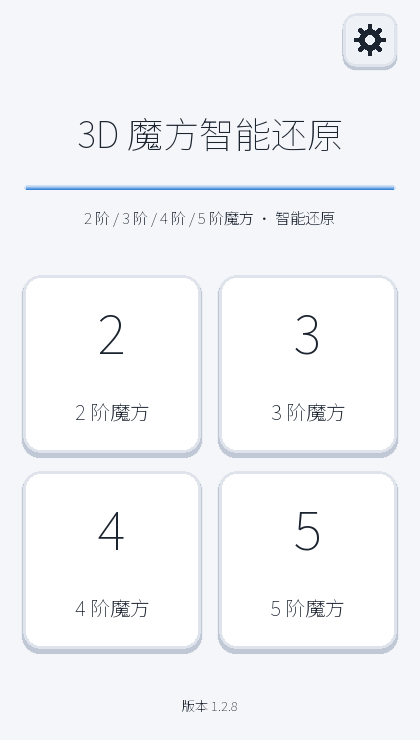
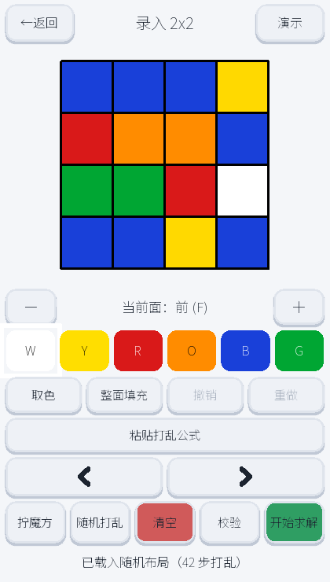
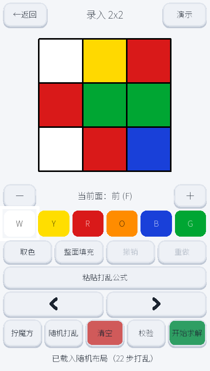
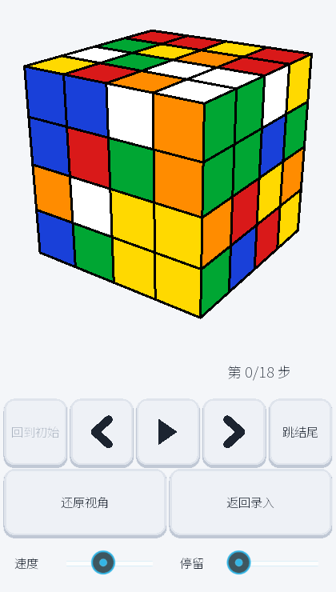
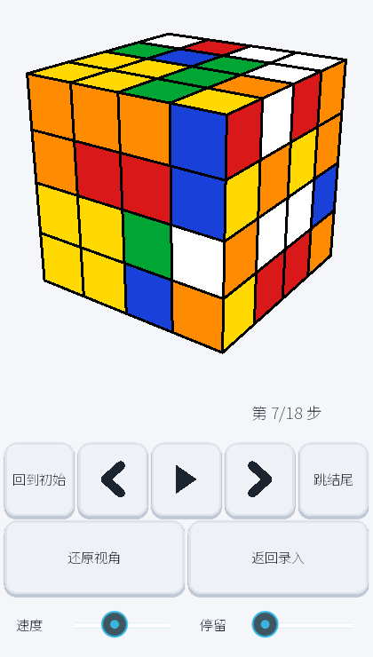

# 🧩 3D魔方智能还原

> **拍一张？不用。把这六个面输进去，剩下的交给算法。** 一个用 Python + Kivy 写的跨平台魔方还原应用，
> 从 6 面色块输入、到 20 步以内的最优还原、再到可交互动画的 3D 回放，全流程开箱即用。


[](https://github.com/coco54-beep/cube-solver/actions/workflows/ci.yml)
[](https://github.com/coco54-beep/cube-solver/releases/latest)

<div align="center">
  
  &nbsp;&nbsp;
  &nbsp;&nbsp;
  &nbsp;&nbsp;
  &nbsp;&nbsp;
</div>

---

## ✨ 亮点

- **真·算法求解**：3 阶走 **Kociemba 两阶段算法**（保证 ≤ 20 步），4 阶走**降阶法**（中心 → 棱配对 → 翻棱 → 按三阶还原），不是背公式、不是查表硬解。
- **零学习成本录入**：展开图点格子填色，支持「随机」一键载入打乱布局、「校验」实时检查状态合法性。
- **沉浸式 3D 回放**：实时渲染的 OpenGL 魔方，拖动旋转、缩放、步进、自动播放、调速度，还原过程看得清清楚楚。
- **跨平台**：桌面（Windows）＋ Android（buildozer 打包），同一套代码。
- **中文界面 · 深色主题**：为触屏优化的大按钮、避免误触的行间距、危险操作二次确认。

---

## 🎬 界面一览

| 页面 | 作用 |
|------|------|
| **首页** | 选择 3 阶 / 4 阶，进入录入、演示或帮助 |
| **录入页** | 六个面的展开图 · 6 色选择器 · 随机 / 校验 / 求解 |
| **求解页** | 后台多阶段求解，实时进度与阶段提示，可取消 |
| **回放页** | 3D 动画演示每一步还原，支持回到初始 / 跳结尾 |

> 过程：`录入魔方 → 一键求解 → 3D 看它还原`。

---

## 🚀 快速开始

### 桌面（Windows）

```bash
pip install -r requirements.txt
python run_desktop.py
```

首次启动会加载求解器预计算表（`twophase/`），稍等片刻即可。

### 打包 Android

使用 [buildozer](https://buildozer.readthedocs.io/)（见 `buildozer.spec`）：

```bash
buildozer android debug
```

---

## 🧠 求解器是如何工作的

- **3 阶**：`solver/solver3.py` 把录入的 54 面转换到 Kociemba 坐标系，调用 `kociemba-src/package_src/twophase` 两阶段求解，再把结果映射回本项目的记号。
- **4 阶**：`solver/solver4.py` 走降阶法 —— 先还原中心块，再配对棱块，处理特殊翻棱（parity），最后按 3 阶方式还原。还原过程按阶段回调进度，UI 实时显示。
- 求解在后台线程运行（`services/solve_service.py`），不阻塞界面，可随时取消。

---

## 📁 仓库结构

```
app/               应用入口、配置与屏幕流程（常量、字体）
ui/                Kivy 界面（kv 主题、屏幕、颜色选择器、面网格）
cube/              魔方逻辑模型（3x3 / 4x4、坐标、记号、校验）
solver/            求解逻辑（Kociemba 桥接 + 4x4 降阶法）
renderer/          3D 渲染（OpenGL 场景、正方体视图、转动动画）
services/          后台求解线程服务
twophase/          两阶段求解器预计算表
kociemba-src/      引用的 Kociemba 求解器源码（GPL-3.0）
tests/             单元测试（pytest）
assets/            字体与着色器（NotoSansSC.ttf）
```

---

## ✅ 测试

```bash
python -m pytest
```

覆盖：3x3 / 4x4 转动、记号解析、输入合法性、3 阶 Kociemba 桥接、4 阶降阶各阶段。

> 4 阶求解需要 `p4_table.bin`（约 300 MB，见仓库根目录 `.gitattributes`，通过 **Git LFS** 管理）。
> 克隆仓库后执行 `git lfs pull` 即可获取；CI 与 APK 构建都已自动处理。

---

## 📦 发布新版

打一个形如 `v1.x.x` 的 git 标签并推送，[GitHub Actions](.github/workflows/release.yml)
会自动构建 **已签名的 release APK** 并发布到 [Releases](https://github.com/coco54-beep/cube-solver/releases)：

```bash
git tag v1.1.0
git push origin v1.1.0
```

- 默认使用**临时密钥**签名（每次构建签名都会变化，旧版需先卸载）。
- 想要**固定签名**（可直接覆盖安装），在仓库 Settings → Secrets 里配置
  `ANDROID_KEYSTORE_B64`（keystore 的 base64）、`ANDROID_KEYSTORE_PASS`、`ANDROID_KEY_ALIAS`。

---

## 📄 许可

本项目以 **[GPL-3.0](LICENSE)** 发布。

> 由于 `solver/solver3.py` 直接封装并随仓库分发 **GPL-3.0** 的 Kociemba 两阶段求解器
> （`kociemba-src/package_src/twophase`），依据 GPL 的传染性条款，本项目整体须以 GPL-3.0 发布。

### 第三方资源

- `assets/fonts/NotoSansSC.ttf`：Google **Noto Sans SC** — [SIL Open Font License 1.1](https://scripts.sil.org/OFL)。
- `kociemba-src/`：Herbert Kociemba 两阶段求解器 — **GPL-3.0**（见 `kociemba-src/LICENSE`）。

---

## 🤝 贡献 & 路线

欢迎提 issue / PR。接下来值得做的方向：

- [x] 补充新版界面截图（首页 / 4×4 录入 / 3×3 录入 / 3D 回放）
- [x] 用 `git-lfs` 收纳超大预计算表，让仓库开箱可跑 4 阶
- [ ] 新增 N 阶（≥5）支持
- [ ] 加一个有声音的引导演示视频
