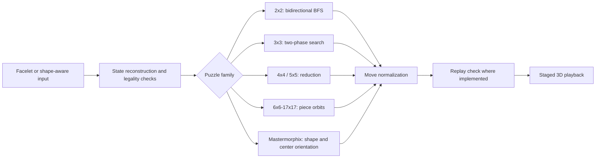

# 3D Cube Solver

### A state-based solving system for 2x2-5x5 cubes, higher-order cubes, and the 3x3 Mastermorphix

[Latest Android release](https://github.com/coco54-beep/cube-solver/releases/latest) · [中文技术说明](README.zh-CN.md) · [Source code](https://github.com/coco54-beep/cube-solver)

## Abstract

This project is a cube-state modeling and solving application that turns a user-entered sticker configuration into a move sequence with solver-specific state and replay checks. Its scope covers conventional 2x2-5x5 cubes, an experimental 6x6-17x17 solver, and a shape-modified 3x3 Mastermorphix. Rather than forcing every puzzle through one search procedure, the system uses a puzzle-specific method: bidirectional search for 2x2, a Kociemba two-phase solver for 3x3, reduction pipelines for 4x4 and 5x5, orbit-based permutation repair for higher-order cubes, and a shape- and orientation-aware model for Mastermorphix.

The engineering focus is the complete path from input to replay: geometric cubie representation, state validation, solver orchestration, move normalization, and solution checking. The project integrates established solving methods where appropriate; it does not claim a new general solution to the cube group or globally optimal solutions. Higher-order solving remains experimental and has not been comprehensively benchmarked across random states and Android devices.

**Keywords:** permutation puzzles; cubie model; reduction method; piece orbits; commutators; Mastermorphix; solution verification

<p align="center">
  
  
  
  
</p>

<p align="center"><sub>Figure 1. Puzzle selection, N x N input, shape-aware input, and verified move playback.</sub></p>

## 1. Scope and contributions

The application addresses three related but distinct problems:

1. **State interpretation.** Convert face colors and shaped-piece orientations into an explicit state that can be checked independently of the scramble history.
2. **Puzzle-specific solving.** Select a suitable solver architecture for each puzzle family instead of treating all orders as a 3x3 search problem.
3. **Reliable presentation.** Preserve stages, emit human-readable moves, and check completed solutions by replay where the solver implements a full-state check.

The project contributions are primarily implementation and integration: a shared geometric cubie model, a custom 2x2 bidirectional search, reduction solvers for 4x4 and 5x5, an orbit-based 6x6-17x17 pipeline, and a dedicated four-color Mastermorphix state and solver. The 3x3 two-phase search is provided by the bundled `hkociemba` implementation and is wrapped by this project.

## 2. State model and solving pipeline

The core model represents a piece by its home coordinate, current coordinate, and visible sticker directions. This distinguishes pieces with identical colors when their positions or orientations matter. Facelet input is converted into this model before solving; odd-order center colors can be used to canonicalize face labels without relying on a recorded scramble.

At a high level, each solve follows this pipeline:

```text
facelet / shape-aware input
            -> cubie state and legality checks
            -> puzzle-specific solving stages
            -> normalized move sequence
            -> replay verification (where implemented)
            -> staged 3D playback
```

Solver stages are returned as structured data rather than a flat string. This allows the interface to explain progress and replay the result while keeping the mathematical state separate from rendering and input widgets.


```mermaid
flowchart LR
    A[Facelet or shape-aware input] --> B[State reconstruction and legality checks]
    B --> C{Puzzle family}
    C --> D[2x2: bidirectional BFS]
    C --> E[3x3: two-phase search]
    C --> F[4x4 / 5x5: reduction]
    C --> G[6x6-17x17: piece orbits]
    C --> H[Mastermorphix: shape and center orientation]
    D --> I[Move normalization]
    E --> I
    F --> I
    G --> I
    H --> I
    I --> J[Replay check where implemented]
    J --> K[Staged 3D playback]
```

<p align="center"><sub>Figure 2. Shared state pipeline with puzzle-specific solver back ends.</sub></p>

## 3. Methods by puzzle family

### 3.1. 2x2: corner-state search

A 2x2 has eight corner pieces and no edge or center pieces. The solver encodes each corner by identity and orientation in one of eight slots. It searches in the half-turn metric (a quarter turn, inverse quarter turn, or half turn each costs one move) using bidirectional breadth-first search from the input and solved states. The implementation expands the smaller current frontier and prunes consecutive turns of the same face and redundant opposite-face orderings.

This is a compact solver specialized to the 2x2 state space. It is time-bounded and returns a solution when the two searches meet; the implementation does not claim globally optimal solutions.

### 3.2. 3x3: two-phase search

The 3x3 facelet state is converted to the cubie coordinates required by the two-phase solver. Phase one reaches the subgroup in which corner and edge orientations are resolved and the four middle-slice edges occupy their designated slice. Phase two solves within that subgroup. Input legality is checked using the cubie model before search.

The search engine is the bundled `hkociemba` / Kociemba two-phase implementation. This project supplies the facelet-to-cubie adapter, state validation, move parsing, and application integration; it does not present the two-phase method as an original algorithm. The method is designed to find practical solutions, not prove a globally shortest sequence.

### 3.3. 4x4: reduction with parity handling

The 4x4 solver follows a reduction pipeline:

1. Solve the six center blocks.
2. Pair the wing pieces that form each of the twelve logical edges.
3. Detect and repair reduction parity cases that do not occur on a 3x3, including OLL- and PLL-type parity.
4. Convert the reduced state to a 3x3 facelet state and solve it with the 3x3 engine.

Center solving can produce several valid reductions. The implementation compares candidates by the compressed length of their center, edge-pairing, and parity prefix, then solves the selected reduced 3x3. The composed stages are applied to a copy of the original cube and the complete 4x4 state is checked before success is reported. The final notation is then compressed using same-face equivalences.

### 3.4. 5x5: center, triple-edge, and orientation reduction

The 5x5 solver first solves center colors, retaining enough piece identity to avoid treating color equality as exact piece identity. It then uses a macro-based edge-reduction planner to assemble each logical edge from its middle edge and two wings. A dedicated middle-edge orientation stage resolves internal orientation constraints that would otherwise make the reduced 3x3 representation invalid.

After reduction, the state is converted to a 3x3 and passed to the shared two-phase solver. The move sequence is simplified using equivalent same-axis slice turns, replayed on the original 5x5 model, and checked for a fully solved state. If the faster center or edge-reduction path fails, the solver has bounded fallback paths; this is a robustness mechanism, not a guarantee of a short or optimal result.

### 3.5. 6x6-17x17: independent piece-orbit solving

For higher-order cubes, the solver does not reduce every sticker directly to a single 3x3. It extracts a 3x3 core from the corners and (for odd orders) the central edge pieces, solves that core, and then handles the remaining pieces by their geometric orbits under legal moves.

The implementation identifies wing and center orbits, validates their visible piece identities and parity constraints, and represents each orbit as a permutation. Three-cycles are decomposed from these permutations. Commutator-like primitive sequences are conjugated to the target locations, expanded into layer turns, and compressed into equivalent notation. Wing orbits are processed before center orbits so that later center operations can absorb their permitted side effects. The complete move list is replayed on a clone of the input and returned only if both the working state and replay state are solved.

This method is implemented for orders 6 through 17. The size range is a software capability, not a claim of comprehensive state-space validation: broad random-state coverage, performance benchmarks, and Android device validation remain incomplete. See [the N x N implementation notes](docs/nxn.md).

### 3.6. 3x3 Mastermorphix: shape and center-orientation model

The four-color Mastermorphix is modeled as a 3x3 mechanism with shaped pieces: eight corner-class pieces, twelve single-color edge wedges, and six two-color center seams. Input and validation are shape-aware. Internally, virtual six-color labels let the movable-piece configuration be mapped to a conventional 3x3 state; these labels are solver bookkeeping and are not required from the user.

The solver first obtains a 3x3 solution for the movable pieces. Because the Mastermorphix exposes center orientation, it then applies center-only generators whose effects are checked to leave movable pieces unchanged. Proper cube rotations generate equivalent macro orientations, and a shortest-path table over the available center-macro set covers the 2,048 reachable center-orientation states. A bounded, best-effort search compares equivalent piece labelings, setup turns, and macro orderings to reduce the move count. The final sequence is replayed against the shape-aware model and must solve both piece placement and visible orientation.

The bounded optimization is not a proof of minimality. See [the Mastermorphix usage and model notes](docs/mastermorphix.md).

## 4. Validation and verification

The validation layer checks the structure relevant to each puzzle: sticker counts and face dimensions, fixed-center color conventions, corner and edge identities/orientations, higher-order orbit consistency, and Mastermorphix shape and center orientation. A syntactically complete color layout is not automatically assumed to be a physically reachable state.

The verification gate differs by solver. The 4x4 path checks the full state after applying its solving stages, before compressing the final notation. The 5x5, N x N, and Mastermorphix paths replay the final sequence on a clone of the original input and require a solved state. The 3x3 path checks state legality before search, while the 2x2 path uses its corner-state encoding; neither wrapper currently performs the same full-model replay check. Across all methods, a returned move list is intended for the application's own notation and simulator.

## 5. Application and reproducibility

The solver is integrated into a Python/Kivy application with color entry, random scrambles, notation paste, validation, undo/redo, cancellation and progress reporting, and staged 3D playback. The application is available as an Android arm64-v8a package and as a desktop Python program.

```bash
git clone https://github.com/coco54-beep/cube-solver.git
cd cube-solver
python -m pip install -r requirements.txt
python run_desktop.py
```

Python 3.10 or newer is required. If the 4x4 solver table is absent, install Git LFS and run `git lfs pull`. The latest Android build is published on [GitHub Releases](https://github.com/coco54-beep/cube-solver/releases/latest).

## 6. Limitations and evaluation status

This README describes the implemented algorithms and verification gates; it does not report controlled benchmark results. There is no published cross-device timing study or move-count comparison in this repository. In particular, 6x6-17x17 solving has not received comprehensive random-state validation or Android performance evaluation. The Mastermorphix move-count search is bounded and heuristic. The 3x3 two-phase solver and 2x2 bidirectional search are not presented as globally optimal solvers.

## References and implementation notes

1. Herbert Kociemba, [The Two-Phase Algorithm](https://kociemba.org/math/twophase.htm). Used through the bundled 3x3 solver.
2. Chris Hardwick, [Wing-orbit parity](https://www.speedcubing.com/chris/lemma2.html) and [center-orbit three-cycles](https://www.speedcubing.com/chris/lemma3.html). Mathematical background for the higher-order orbit construction; the code implements its own coordinate and move model.
3. Jaap Scherphuis, [Rubik's Cube variants, including Mastermorphix](https://www.jaapsch.net/puzzles/cubevari.htm), and [Supergroup theory](https://www.jaapsch.net/puzzles/theory.htm). Background for shaped-cube and oriented-center behavior.
4. [N x N solver notes](docs/nxn.md) · [Mastermorphix notes](docs/mastermorphix.md) · [Source code](https://github.com/coco54-beep/cube-solver)

This project is distributed under the [GNU General Public License v3.0](LICENSE). The bundled two-phase solver is attributed in its source and distributed under its respective license terms.
