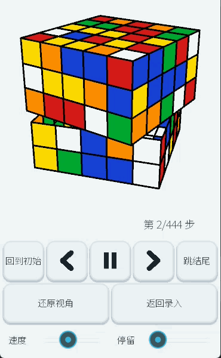

<div align="center">

# 3D Cube Solver

**Paint a cube. Find a solution. Watch every turn in 3D.**

Solve standard 2×2–5×5 cubes, 6×6–17×17 cubes, and the 3×3 Mastermorphix on Android or desktop.

[Download the latest Android APK](https://github.com/coco54-beep/cube-solver/releases/latest) · [中文说明](README.zh-CN.md) · [Explore the solvers](#how-the-solvers-work)

[](https://github.com/coco54-beep/cube-solver/releases/latest)
[](https://github.com/coco54-beep/cube-solver/actions/workflows/ci.yml)
[](LICENSE)

</div>

## What's new in 1.2.17

| Feature | Description |
|---|---|
| **3×3 Mastermorphix** | Dedicated shape-aware entry, color palette, validation, random scramble, solver, step-by-step 3D playback and teaching examples. See the [Mastermorphix guide](docs/mastermorphix.md). |
| **6×6–17×17 cubes** | Select an order, enter or scramble a state, solve it and replay the result. The solver reports progress and verifies the complete solution before returning it. Runtime depends on the order and scramble; Android performance is not yet comprehensively benchmarked. See [N×N solver notes](docs/nxn.md). |
| **Responsive layouts** | Input, solving progress, playback, demos and twist controls adapt between portrait and landscape. |
| **Solver improvements** | Updated high-order and Mastermorphix solving paths, with complete-solution checks before results are returned. |
| **Guidance** | Settings include an icon guide; the home screen provides demos for supported cube types. |

---

## See it in action

<div align="center">



*Animated 3D playback · explore the solution one move at a time*


</div>

---

## Make the cube yours

| 01 · Enter | 02 · Solve | 03 · Replay |
|:---|:---|:---|
| Choose 2×2–5×5, N×N, or Mastermorphix. Enter colors, generate a scramble, or paste move notation. | Validate the state and run the matching solver. Progress is shown while longer solves run. | Step through the solution in 3D; rotate, zoom, pause or resume playback. |

- **Multiple puzzle types** — 2×2–5×5, N×N from 6×6 through 17×17, and the 3×3 Mastermorphix.
- **Two input layouts** — a compact layout for quick entry and an advanced layout with editing tools.
- **Interactive playback** — rotate, zoom, step through moves, and control playback.
- **Built-in guidance** — demonstrations, theme and language settings, and an icon guide in Settings.
- **Android and desktop** — one Python/Kivy codebase.

## Download and run

### Android

Get the latest signed Android APK from [GitHub Releases](https://github.com/coco54-beep/cube-solver/releases/latest). APK builds target **arm64-v8a** devices; check the release notes for the current package and update instructions.

> The release workflow uses a new signing key for each build unless a persistent keystore is configured. When updating from a build signed with another key, uninstall the old app first.

### Desktop

Requires Python 3.10+.

```bash
pip install -r requirements.txt
python run_desktop.py
```

The first solver run may take a moment while it loads its tables.

### Build an Android debug APK

```bash
buildozer android debug
```

See [`buildozer.spec`](buildozer.spec) for the Android configuration.

---

## 🧠 How the solvers work

- **2×2**: `solver/solver2.py` maps the 2×2 directly onto a subset of 3×3 cubies and runs Kociemba.
- **3×3**: `solver/solver3.py` converts the 54 input facelets into Kociemba coordinates, calls the two-phase solver in `kociemba-src/package_src/twophase`, and maps the result back into this project's notation.
- **4×4**: `solver/solver4.py` uses reduction — solve the centers, pair the edges, handle special flipped edges (parity), then solve as a 3×3. Progress is reported per stage and shown live in the UI.
- **5×5**: `solver/solver5.py` runs a full reduction pipeline —
  **① solve centers** (`solver/center5`: conjugated 3-cycles + setup tables + color equivalence);
  **② reduce edges** (`solver/edge5` + `solver/reduction/ref5`: free-slice pairing, with a macro-level A\* endgame placing all 12 tredges);
  **③ fix middle-edge orientation** (`middle_orient_fix`: GF(2) linear elimination of internal flips);
  **④ collapse to 3×3**, hand it to Kociemba, then replay back on the 5×5;
  the endgame judges success by **"all homes complete + virtual 3×3 valid"**, returning a structured failure for over-deep scrambles rather than emitting a wrong solution.
- Solving runs on a background thread (`services/solve_service.py`); the UI never blocks and can cancel at any time.

---

## 🔬 Algorithm research & optimization

This project does more than "just solve" — **every stage of the 4×4 and 5×5 reduction** has been **modeled, implemented, experimentally validated and tuned**. If you care about the technical details, this is the interesting part.

<details>
<summary><b>📌 Click to expand: the full 4×4 reduction research notes</b></summary>

### 1. Centers: two-stage descent + seeded variants (`solver/reduction/center_solver.py`)

- Split the center state into a **joint code** and a **side code**, solved separately, each using precomputed distance tables for a **descent** toward the target.
- `solve_centers_variant(cube, seed)` re-rolls isomorphic descents by `seed` to produce **multiple equivalent optimal solutions** — the channel that later enables OLL parity avoidance.

### 2. Edge pairing: swap primitive + exact gain simulation (`solver/reduction/edge_pairing.py`)

- **Swap primitive P**: `u R U R' F R' F' R u'` (9 moves). It swaps the `FR-bottom ↔ BR-top` wings while **rotating all four U-layer edge groups as a whole** (keeping already-paired groups intact), and produces an extra 2-cycle — so a single swap can **pair 2~3 slots at once**.
- **Exact gain simulation** `_simulate_swap_gain`: instead of under- or over-estimating, it uses the real permutation of the 24 wing positions to compute the net increase in paired slots after `setup + P + setup'` (1~3), so greedy/beam can pick genuinely worthwhile swaps.
- **Multi-objective ordering**: candidates are sorted by `(-net gain, compressed length, setup length)`, balancing fewer moves and more pairs per swap.
- **Bidirectional setup BFS**: `_find_setup_pair` uses meet-in-the-middle under two target orders to find the shortest setup, avoiding the exponential blow-up of one-directional forward search.
- **Tail beam search** `_pair_beam_finish`: late-stage greedy tends to get stuck in local optima, so a bounded beam (ranked by compressed length, allowed to "descend into valleys") refines the tail, falling back to greedy when the budget runs out.

### 3. Parity: from post-hoc fix to pre-emptive avoidance (`solver/reduction/parity.py` + `solver4.py`)

- On 4×4, **OLL parity (a single flipped edge)** is determined solely by the parity of the number of inner-slice 90° turns (`_inner_parity`).
- So we **avoid rather than fix**: we enumerate multiple center solutions in advance (`_CENTER_SELECT_EXTRA`), pick the one whose inner parity matches the target, and re-roll the corresponding reduction — making **OLL naturally even** after edge pairing and saving ~**15 moves** of OLL repair. Verified on 48/48 test states.
- **PLL parity (edge-group permutation parity)** changes with the last swap: the tail beam **prefers the complete state that is directly 3×3-solvable**, avoiding PLL repair (6 moves).

### 4. Performance optimization (measured)

| Optimization | Effect |
|------|------|
| `clone()` from `deepcopy` to per-cubie shallow copy | Hits the biggest hotspot, major speedup |
| Center candidate count and tail beam size characterised as a steps/time trade-off | Keeps optimal step counts when steps are prioritized |
| Layered greedy + bounded beam | Keeps beam time bounded without significantly worsening step counts |

> Experiments confirm the 9-move edge-pairing primitive P is the **shortest feasible primitive satisfying "can complete pairing"** (shorter `w X w'` candidates and a bare `R2` cannot pair); the swap count is already near the greedy lower bound, and larger beam searches have saturated their benefit on total moves.

</details>

<details>
<summary><b>📌 Click to expand: the full 5×5 reduction research notes (from zero to usable)</b></summary>

No off-the-shelf library exists for 5×5, so this pipeline was **built from scratch and validated step by step**: centers → edge pairing → orientation fix → collapse to 3×3.

### 1. Centers: conjugated 3-cycles + setup tables (`solver/center5/`)

- Split the 5×5 movable centers into **corner / edge orbits**, solved independently (verified non-interfering).
- Misplaced centers form a **pos→home permutation**; first normalize each orbit's parity to even with a very short prefix, then decompose the even permutation into **forward 3-cycles**, applied one by one via **`S' P S` conjugation**.
- Each primitive's setup needs just **one BFS** over that orbit (covering 24×23×22 = **12144** ordered triples); afterwards every conjugation is a table lookup, no re-search.
- Then **color equivalence** (only requiring color-correct faces, allowing same-color swaps) splits long permutations into shorter cycles, cutting the macro count **346 → 248 (~-28%)**.
- **Near the algorithmic floor**: short primitives exhausted, setups BFS-optimal; plus a structural result — **no joint primitive of ≤ 8 moves doing one corner + one edge 3-cycle exists**.

### 2. Edge pairing: free-slice + macro library + macro-level A\* endgame (`solver/edge5/` + `solver/reduction/ref5/`)

- **Free-slice** idea: allow the centers to be temporarily disturbed while a free slice is open, restoring them in batch with `W + outer moves + W'` macros, instead of immediately restoring centers after each paired edge.
- Upgrade the "middle edge + two wings" clustering relation from "complete or not" to a **0~3-level relation score**, letting the search judge progress even when incomplete.
- The endgame uses **macro-level A\***: abstract state = `(middle-edge home, wing-pair home)` per slot; generators are whole-transport 3-cycles, pure middle-edge 3-cycles and outer 4-cycles; the heuristic is the number of mismatches. The resulting macro sequence is replayed on a real `Cube5` with **center / fixed / valid triple assertions**.
- Key criterion fix: the endgame should be judged by **"all homes complete + virtual 3×3 valid"**, not "every tredge correctly oriented" (an even orientation still yields a valid virtual 3×3).

### 3. Middle-edge orientation fix: GF(2) linear algebra (`ref5/middle_orient_fix.py`)

- `reduce5` only guarantees middle-edge and wing **color-pair** alignment, not same-slot same-orientation; such "internal flips" are masked by the virtual 3×3 and leave the cube unsolved after playback.
- Use macro words that are "identity on middle edges + flip an even number of middle edges" to eliminate `d = mid_orient XOR wing_orient` — the orientation update is affine, so the problem is equivalent to **finding a mask subset XOR over GF(2)**. Orientation moves: **147 → 52 (mean over 5 seeds)**.

### 4. Step counts & performance (measured)

| Stage | Average moves |
|------|---------|
| Centers | ~201 |
| Edge pairing | ~129 |
| Endgame macros + OLL | ~42 |
| Orientation fix | ~34 |
| 3×3 | ~20 |
| **Total** | **≈ 420 moves** |

- End-to-end from the first version **~711 down to a holdout mean of 422 (~-41%)**, worst 453 / min 380; all 20 non-tuned seeds succeed.
- Pure-Python hot-path optimization: mask-space Dijkstra table computed once, `Macro.apply` with precomputed indices, `map` instead of genexpr → **end-to-end 5.47 s → steady ~2.2 s**.
- Tuning kept a **non-tuned holdout set** (seeds 100-129) to prevent overfitting: a larger search budget gave no holdout gain, so the better-step configuration was kept.

### 5. Mobile experience: bundled prebuilt tables + background warm-up

- Center setup tables are **pre-generated offline and shipped in the APK** (`solver/center5/data/`, 5 files, ~2 MB total), hit directly on first launch — **no BFS** (`builds=0`).
- A background **warm-up thread** preloads the Kociemba two-phase tables and each solver so the first solve isn't a long wait; moving the pre-first-frame synchronous import out of the startup path eliminates the black screen on launch.

> Interim conclusion: each stage is near this framework's algorithmic limit (centers ~200 moves, pairing near the floor); significantly fewer moves would require a fundamentally different algorithm (human-style commutator intuition search / a general setup solver), with a low return on investment today.

</details>

---

## 📁 Repository layout

```
app/               App entry, config and screen flow (constants, fonts)
ui/                Kivy UI (kv theme, screens, color picker, face grid)
cube/              Cube logic models (2x2 / 3x3 / 4x4 / 5x5, coordinates, notation, validation)
solver/            Solving logic (2/3 Kociemba bridge + 4/5 reduction)
  center5/         5x5 centers (conjugated 3-cycles + setup tables; data/ holds bundled tables)
  edge5/           5x5 edge pairing (free-slice, macro library, compact-state search)
  reduction/ref5/  5x5 endgame reference pipeline (macro A*, orientation fix, simplification)
renderer/          3D rendering (OpenGL scene, cube view, turn animation)
services/          Background solving thread service
twophase/          Two-phase solver precomputed tables
kociemba-src/      Vendored Kociemba solver source (GPL-3.0)
tests/             Unit tests (pytest)
assets/            Fonts, shaders and demo assets (NotoSansSC.ttf)
```

---

## ✅ Tests

```bash
python -m pytest
```

Coverage includes 2×2 through 5×5 turns, notation parsing, input legality, the 2×2/3×3 Kociemba bridge, 4×4 and 5×5 reduction, and solve progress callbacks.

> 4×4 solving needs `p4_table.bin` (~300 MB, managed via **Git LFS**; see `.gitattributes` at the repo root).
> Run `git lfs pull` after cloning; CI and APK builds handle it automatically.

---

## 📦 Releasing

Push a git tag of the form `v1.x.x` and [GitHub Actions](.github/workflows/release.yml)
will build a **signed release APK** and publish it to [Releases](https://github.com/coco54-beep/cube-solver/releases):

```bash
git tag vX.Y.Z
git push origin vX.Y.Z
```

- By default it is signed with an **ephemeral key** (the signature changes every build, so uninstall the old version first).
- For a **stable signature** (direct overwrite install), configure
  `ANDROID_KEYSTORE_B64` (base64 of the keystore), `ANDROID_KEYSTORE_PASS` and `ANDROID_KEY_ALIAS` in repo Settings → Secrets.

---

## 📄 License

Released under **[GPL-3.0](LICENSE)**.

> Because `solver/solver3.py` wraps and redistributes the **GPL-3.0** Kociemba two-phase solver
> (`kociemba-src/package_src/twophase`), the project as a whole must be released under GPL-3.0
> due to GPL's copyleft terms.

### Third-party assets

- `assets/fonts/NotoSansSC.ttf`: Google **Noto Sans SC** — [SIL Open Font License 1.1](https://scripts.sil.org/OFL).
- `assets/icons/lucide/`: **Lucide** icons; see [its license](assets/icons/lucide/LICENSE.txt).
- `kociemba-src/`: Herbert Kociemba's two-phase solver — **GPL-3.0** (see `kociemba-src/LICENSE`).

---

## 🤝 Contributing & roadmap

Issues and PRs are welcome. Directions worth pursuing:

- [x] Refresh UI screenshots (home / 4×4 input / 3×3 input / 3D playback)
- [x] Use `git-lfs` for the huge precomputed tables so 4×4 runs out of the box
- [x] Add support for N×N (≥ 5) cubes (2 / 3 / 4 / 5 all usable)
- [x] Full 5×5 reduction pipeline (conjugated center 3-cycles / free-slice pairing / macro-level A\* endgame / GF(2) orientation fix), **~711 → ~420 moves**
- [x] Faster solving on mobile: bundled prebuilt tables (no BFS) + background warm-up + solve progress display, and a startup black-screen fix
- [x] Generate the demo animation GIF (`assets/demo.gif`, regenerable via `tools/make_demo_gif.py`)
- [ ] Add a narrated onboarding demo video
