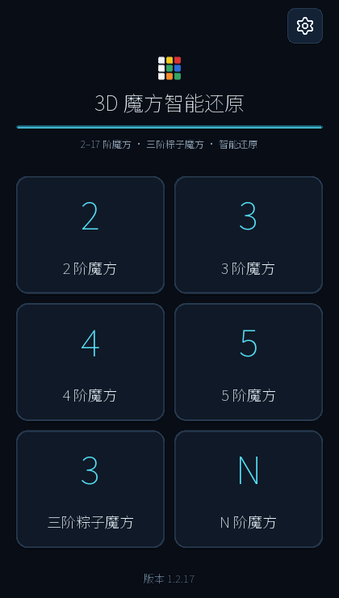
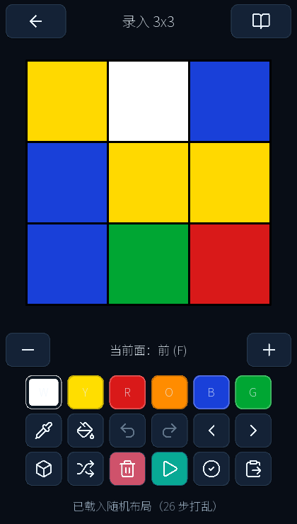
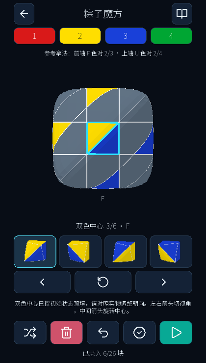
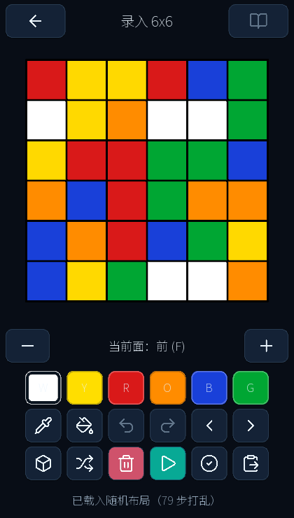

# 3D 魔方智能还原

**录入魔方状态、检查颜色，再用 3D 回放跟着每一步还原。**

手动输入各面颜色、生成随机打乱，或粘贴转动公式。校验状态后即可求解，并逐步观看每一次转动。

**支持 2×2–5×5 · 3×3 粽子魔方 · 实验性支持 6×6–17×17**

[下载最新版 Android 安装包](https://github.com/coco54-beep/cube-solver/releases/latest) · [English](README.md) · [全部版本](https://github.com/coco54-beep/cube-solver/releases)

## 界面预览

<p align="center">





</p>

## 选择魔方

| 类型 | 功能 |
| --- | --- |
| **2×2–5×5** | 录入颜色、校验状态、求解和回放；支持随机打乱与粘贴公式。 |
| **3×3 粽子魔方** | 适配异形外观的录入、校验、求解和 3D 回放。 |
| **6×6–17×17** | 可录入、打乱和求解高阶魔方，目前仍是实验功能。 |

## 四步还原

1. 选择魔方类型和阶数。
2. 点选颜色、粘贴公式，或生成随机打乱。
3. 校验状态并开始求解。
4. 在 3D 场景中旋转、缩放魔方，逐步播放解法或调整播放速度。

另有简洁/高级录入、撤销/重做、演示页面、中英日界面、横竖屏布局和明暗主题。

## 下载与运行

### Android

从 [GitHub Releases 下载最新版](https://github.com/coco54-beep/cube-solver/releases/latest)。安装包面向 **arm64-v8a**。

### 电脑

需要 Python 3.10 或更新版本。

```bash
git clone https://github.com/coco54-beep/cube-solver.git
cd cube-solver
python -m pip install -r requirements.txt
python run_desktop.py
```

如果缺少 4×4 求解数据表，请安装 Git LFS 并运行 `git lfs pull`。

## 求解方式

| 魔方 | 方法 |
| --- | --- |
| 2×2、3×3 | Kociemba 两阶段搜索 |
| 4×4、5×5 | 先降阶到 3×3，再求解 |
| 粽子魔方 | 异形状态转换与专用 3×3 求解流程 |
| 6×6–17×17 | 实验性高阶求解器，仍在评估覆盖范围和性能 |

6×6–17×17 尚未全面测试随机状态覆盖、不同设备性能和 Android 实机表现，请将结果视为实验性功能。

## 参与项目

运行测试：`python -m pytest`。查看[高阶魔方说明](docs/nxn.md)和[粽子魔方说明](docs/mastermorphix.md)。欢迎提交问题和改进。本项目采用 [GPL-3.0](LICENSE) 许可证。
