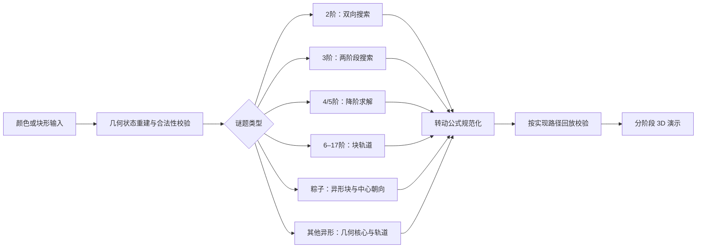

# 3D 魔方智能还原

### 面向常规、高阶与异形魔方的状态建模和求解系统

[下载最新版 Android 安装包](https://github.com/coco54-beep/cube-solver/releases/latest) · [English technical overview](README.md) · [源代码](https://github.com/coco54-beep/cube-solver)

> **异形魔方已加入 1.2.18：** 金字塔、斜转、五魔方、魔塔、镜面与粽子魔方均有独立的模型、转动和 3D 回放入口。

## 摘要

本项目将用户录入的颜色或块形状态转换为可校验的魔方状态，并按谜题机构生成还原步骤。除常规 2–5 阶、实验性的 6–17 阶及 2–9 阶粽子魔方外，1.2.18 新增金字塔魔方、斜转魔方、五魔方、魔塔魔方和镜面魔方。各类型开放的阶数为 2–13 阶不等。系统为不同外形建立独立几何状态与合法转动模型，不把所有谜题简化成普通三阶输入。

项目工作的重点在完整求解链路：几何块状态表示、录入合法性检查、分阶段求解、转动记号转换，以及在实现了全状态校验的求解器中回放检查。项目集成了成熟算法，并不宣称提出新的通用魔方群理论，也不宣称所有解均为全局最短解。N 阶功能仍属实验阶段，尚未完成全面的随机状态覆盖和 Android 实机性能评测。

**关键词：** 状态建模；几何转动；异形魔方；块轨道；降阶求解；三循环；回放校验

<p align="center">
  
  
  
  
</p>

<p align="center"><sub>图 1：魔方选择、N 阶录入、异形状态录入与步骤回放。</sub></p>

## 1. 问题范围与项目工作

应用围绕四项工作展开：从颜色或块形输入重建状态；按谜题机构选择求解方法；为非立方体结构实现独立的转动与 3D 回放；以及通过阶段步骤与状态回放检查结果。项目实现包括 2 阶双向搜索、4/5 阶降阶求解、6–17 阶轨道求解、2–9 阶粽子魔方模型，以及金字塔、斜转、五魔方、魔塔和镜面魔方的几何状态引擎。3 阶两阶段搜索使用仓库内的 `hkociemba` 实现，本项目负责状态适配、校验和界面集成。

1. **状态解释：** 将用户录入的色块和异形块朝向转换为明确状态，不依赖软件是否记录了打乱历史。
2. **分类型求解：** 根据不同阶数的块结构选择求解架构，而不是把所有问题都简化成普通三阶。
3. **可靠呈现：** 将求解结果保留为可解释的阶段，转换为应用支持的转动记号，并在适用的求解器中检查完整回放结果。

项目的主要工作是算法实现与工程集成：共享几何块模型、自主实现的 2×2 双向搜索、4×4/5×5 降阶求解、6×6–17×17 轨道求解，以及四颜色三阶粽子魔方的状态模型和专用求解流程。3×3 两阶段搜索来自项目内置的 `hkociemba` 实现；本项目负责其状态转换、校验封装和应用接入，不将该算法归为原创。

## 2. 状态表示与总体流程

核心状态模型为每个块记录其初始坐标、当前位置和各贴纸方向。即使两个块颜色相同，只要它们的位置身份或朝向对求解有影响，状态模型仍可以区分它们。用户输入的面色先转换为该模型，再进入对应求解流程；奇数阶魔方还可以利用固定中心颜色确定规范面向，无须知道打乱公式。

总体流程如下：

```text
色块 / 异形外观录入
          → 块状态重建与合法性检查
          → 对应阶数的分阶段求解
          → 转动公式规范化
          → 回放校验（由相应求解器执行）
          → 3D 分步演示
```

求解阶段以结构化数据返回，而不是只返回一串公式。因此界面可以显示阶段进度并逐步回放，同时让求解逻辑独立于颜色录入控件和 3D 渲染。



<p align="center"><sub>图 2：共享状态处理流程与按魔方类型选择的求解器。</sub></p>

## 3. 各类魔方的求解方法

### 3.1. 2×2：角块状态与双向搜索

2×2 只有八个角块，没有棱块和中心块。求解器将角块身份和朝向编码到八个角槽中，并在 HTM 计步规则下搜索：转 90°、转 90° 的逆操作和转 180° 均计为一步。搜索从输入状态和复原状态两端进行双向广度优先扩展，每轮扩展当前较小的边界；搜索会剪除同一面连续转动和可交换的对面冗余顺序。

该方法利用了 2×2 的小状态结构，并设有时间限制。两侧搜索相遇后返回一条解；实现不承诺全局最短。

### 3.2. 3×3：Kociemba 两阶段搜索

3×3 面色状态会转换为两阶段求解器所需的角块和棱块坐标。第一阶段把状态送入一个子群：角块与棱块朝向满足约束，四个中层棱块进入指定切片；第二阶段在该子群中完成复原。搜索前会检查状态合法性。

搜索引擎使用项目内置的 `hkociemba` / Kociemba 两阶段实现。本项目提供面色到块状态的适配、合法性校验、转动公式解析和应用接入；两阶段方法属于既有算法，目标是得到实用解法，不保证全局最短。

### 3.3. 4×4：带奇偶修正的降阶求解

4×4 采用以下降阶流程：

1. 还原六面的中心块。
2. 配对十二组翼棱，使每组可作为一条逻辑棱处理。
3. 检测并修正降阶后才会出现的奇偶情形，包括 OLL 和 PLL 类型奇偶。
4. 将降阶状态转换为 3×3 面色状态，交由 3×3 求解器完成复原。

中心阶段可以产生多种合法结果。程序按中心、配棱和奇偶修正前缀的压缩长度比较候选，再对选中的降阶三阶状态求解。求解阶段会作用于原始 4×4 状态副本，并在转动记号压缩前检查完整状态是否复原；随后再对输出记号执行同面合并。

### 3.4. 5×5：中心、三片棱组与朝向归约

5×5 首先还原六面中心颜色，同时保留足够的块身份信息，避免将同色块直接视为同一个块。随后使用基于宏公式的棱归约规划器，将每条逻辑棱的中棱与两侧翼棱组合成完整棱组。单独的中棱朝向修正阶段处理内部朝向约束，避免降阶后的 3×3 表示丢失必要状态。

完成归约后，将状态转换为 3×3 并调用同一两阶段求解器。程序会简化等价的同轴切片转动，在原始 5×5 模型上回放整条公式，并检查魔方是否完全复原。若较快的中心或棱归约路径失败，求解器还提供有界回退路径；这提高的是鲁棒性，不代表解法最短或所有状态都能在固定时间内完成。

### 3.5. 6×6–17×17：独立块轨道求解

高阶求解器不会把所有贴纸直接压缩成一个三阶状态。它先从角块以及奇数阶的中心棱块中提取 3×3 核心并求解，再根据合法转动下块的位置轨道处理其余块。

程序识别翼棱轨道和中心轨道，校验块身份及置换奇偶，并将每个轨道写成置换。随后把置换分解为三循环，通过类似交换子的基本公式构造操作，再用共轭将操作定位到目标块；最后将抽象操作展开为具体层转公式并压缩等价记号。流程先处理翼棱轨道，再处理中心轨道，使中心步骤能够吸收允许的副作用。最终公式会在输入状态副本上完整回放，只有工作状态和回放状态都已复原才返回成功。

当前实现覆盖 6 至 17 阶。这表示软件支持这些阶数的求解流程，不等同于已经全面验证其状态空间。随机状态覆盖、性能基准和 Android 实机验证尚不完整。详见 [N 阶实现说明](docs/nxn.md)。

### 3.6. 2–9 阶粽子魔方：块形与朝向模型

四颜色三阶粽子魔方按三阶机构建模，但块的形状会携带额外方向信息：八个角块类部件、十二个单色棱楔和六个双色中心接缝。录入和校验均考虑异形外观。内部使用虚拟六色贴纸标签将可动块状态映射为普通三阶状态；这些标签只用于求解，不要求用户输入。

求解器先求出可动块的三阶解，再处理可见中心朝向。中心宏公式的效果会先经过检查，确保不改变可动块；宏公式通过合法的整体旋转生成不同方向版本，并在 2,048 个可达中心朝向状态上、针对当前中心宏集合建立最短路径表。额外的有界搜索会比较等价块标记、预转步骤和中心宏顺序，尝试缩短总步数。最终公式会在异形状态模型上回放，检查块位置和可见朝向均已复原。

该优化搜索有时间预算，是尽力改进而非全局最短性证明。详见 [粽子魔方模型与使用说明](docs/mastermorphix.md)。

### 3.7. 异形魔方：独立几何与转动模型

**1.2.18 已加入异形魔方目录和专用操作界面。** 下表列出应用中开放的类型和阶数；不同外形分别使用对应的合法转动模型。

| 类型 | 应用支持阶数 | 状态表示与求解方式 |
|---|---:|---|
| 金字塔魔方 | 2–7 阶 | 四面体贴纸几何；二阶模型单独处理四个可动尖角，高阶由核心状态和块轨道逐步求解。 |
| 斜转魔方 | 3、5、7 阶 | 按顶点转动结构建模，从贴纸状态重建后按核心与轨道求解。 |
| 五魔方 | 2–13 阶 | 十二面体几何；2–3 阶使用预计算的强生成序列（SGS），高阶使用核心降阶与三循环处理块轨道，偶数阶按 Kilominx 机构建模。 |
| 魔塔魔方 | 3–7 阶 | 根据其多面体切层结构生成合法转动置换，并对还原结果进行几何回放。 |
| 镜面魔方 | 2–9 阶 | 按块的尺寸与朝向录入，不需要颜色；使用对应阶数的角块或高阶求解器还原块身份。 |
| 粽子魔方 | 2–9 阶 | 四颜色异形块模型；三阶会额外记录中心接缝朝向，其他阶数使用相应的普通或高阶状态求解器。 |

多面体求解器从几何结构生成贴纸转动置换，不依赖打乱历史。拧动界面独立于录入页，支持选轴与层、手动转动、撤销/重做和视角锁定；还原演示保留对应外形，提供步骤导航、速度和停留时间设置。更多输入规则、阶数说明及实现边界见[异形魔方模型与使用说明](docs/irregular-puzzles.md)。

## 4. 状态合法性与解法校验

校验层按谜题结构检查面尺寸和颜色数量、异形几何的合法转动轨道、固定中心配色、角块与棱块身份及朝向、高阶块轨道一致性、镜面魔方块形和粽子魔方中心朝向。输入完整的颜色图案并不自动意味着该状态可以由合法转动到达。

校验门槛因求解器而异。4×4 会在求解阶段完成后、最终公式压缩前检查完整状态。5×5、N 阶和粽子魔方会将最终公式回放到原始输入副本，并要求状态复原。3×3 在搜索前检查状态合法性；2×2 使用角块状态编码。这两者的求解封装目前没有执行相同的完整模型回放检查。所有方法返回的公式均面向本应用支持的转动记号和模拟器。

## 5. 应用与复现

应用提供颜色或块形录入、随机打乱、公式粘贴、校验、撤销/重做、取消与进度提示；异形魔方另有独立拧动界面和保持原模型的分阶段 3D 演示。

```bash
git clone https://github.com/coco54-beep/cube-solver.git
cd cube-solver
python -m pip install -r requirements.txt
python run_desktop.py
```

需要 Python 3.10 或更新版本。如果缺少 4×4 求解数据表，请安装 Git LFS 并运行 `git lfs pull`。Android 安装包发布在 [GitHub Releases](https://github.com/coco54-beep/cube-solver/releases/latest)。

## 6. 限制与评测状态

本文说明当前实现和校验流程，不代表已完成受控性能评测。当前 6–17 阶及新加入异形魔方的随机状态覆盖和 Android 性能验证仍不完整；粽子魔方的步数优化有界且启发式；其他求解器也不作全局最优承诺。

## 参考资料与实现说明

1. Herbert Kociemba，[The Two-Phase Algorithm](https://kociemba.org/math/twophase.htm)。本项目通过内置 3×3 求解器使用该算法。
2. Chris Hardwick，[翼棱轨道奇偶](https://www.speedcubing.com/chris/lemma2.html)与[中心轨道三循环](https://www.speedcubing.com/chris/lemma3.html)。为高阶轨道构造提供数学背景；本项目使用自己的坐标和转动模型实现。
3. Jaap Scherphuis，[魔方变体与 Mastermorphix](https://www.jaapsch.net/puzzles/cubevari.htm)及[Supergroup 理论](https://www.jaapsch.net/puzzles/theory.htm)。为异形块和带朝向中心的处理提供背景。
4. [N 阶求解说明](docs/nxn.md) · [粽子魔方说明](docs/mastermorphix.md) · [源代码](https://github.com/coco54-beep/cube-solver)

本项目采用 [GNU GPL v3.0 许可证](LICENSE)。内置两阶段求解器的来源和许可证信息见其源代码。
